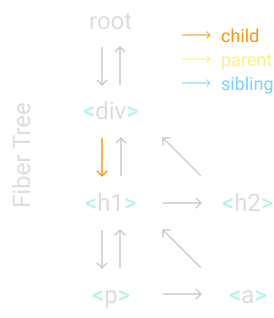
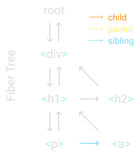
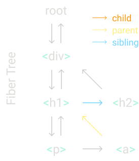

# react-rewritten
:atom_symbol: A deep study about the React Framework internals based on rewriting it by hand

## 🌆 How React works
In react we work with something called **Fiber Tree**.

A **Fiber Tree** is a simple concept that revolves around the way react works internally treating all **DOM Elements** as a **Element Tree** in order to render all of them (we can call it a **Linked List** of **DOM Elements** as well).

Below you can see a simple example (credits on [Extra](#extra-info)):

1. Every element is a **fiber**. Besides, it can have a **sibling** or a **parent**.


<br />

2. Once we finish making work on a **fiber**, if it has a **child**, it will be the next work we'll get done. So, if we're making some work on the **div**, after we finish it we'll make some work on the **child** **h1**.



<br />

3. Once we finish the work and the current **fiber** has no **children**, we'll look to get some work done on the **sibling**. By the example, after making work on **p**, we'll get some work done on **a**.



<br />

4. After making the work on the **sibling**, we'll go up the its **parent**. If the **parent** does not have any **children** or some work to be done, we go the **uncle** (the **sibling** of the **parent**).



<br />

5. In the end of all work process, we'll reach the **root** **fiber** and everything is ready to be rendered by the browser.

<a name="extra-info"></a>

## 🌊 Extra

- All the internal functions are inside the folder ```Recast/src/lib/Recast.js```.

- Credits for the code and assets to the incredible [https://pomb.us/build-your-own-react](https://pomb.us/build-your-own-react).

## 🌋 Running

1. Go inside the folder ```Recast```
```sh
cd Recast
```

2. Install the dependencies
```sh
npm install
```

3. Run the application
```sh
npm start
```

4. Go to browser on the following url: ```http://localhost:3000```